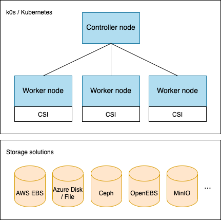

# Storage

## Bundled OpenEBS storage

K0s comes out with bundled OpenEBS installation which can be enabled by using [configuration file](./configuration.md)

Use following configuration as an example:

```yaml
spec:
  extensions:
    storage:
      type: openebs_local_storage
```

The cluster will have two storage classes available for you to use:

```shell
k0s kubectl get storageclass
```

```shell
NAME               PROVISIONER        RECLAIMPOLICY   VOLUMEBINDINGMODE      ALLOWVOLUMEEXPANSION   AGE
openebs-device     openebs.io/local   Delete          WaitForFirstConsumer   false                  24s
openebs-hostpath   openebs.io/local   Delete          WaitForFirstConsumer   false                  24s
```

The `openebs-hostpath` is the storage class that maps to the `/var/openebs/local`

The `openebs-device` is not configured and could be configured by [manifest deployer](manifests.md) accordingly to the [OpenEBS documentation](https://docs.openebs.io/)

### Example usage

Use following manifests as an example of pod with mounted volume:

```yaml
apiVersion: v1
kind: PersistentVolumeClaim
metadata:
  name: nginx-pvc
  namespace: default
spec:
  accessModes:
    - ReadWriteOnce
  storageClassName: openebs-hostpath
  resources:
    requests:
      storage: 5Gi
---
apiVersion: apps/v1
kind: Deployment
metadata:
  name: nginx
  namespace: default
  labels:
    app: nginx
spec:
  selector:
    matchLabels:
      app: nginx
  strategy:
    type: Recreate
  template:
    metadata:
      labels:
        app: nginx
    spec:
      containers:
      - image: nginx 
        name: nginx
        volumeMounts:
        - name: persistent-storage
          mountPath: /var/lib/nginx
      volumes:
      - name: persistent-storage
        persistentVolumeClaim:
          claimName: nginx-pvc
```

```shell
k0s kubectl apply -f nginx.yaml
```

```shell
persistentvolumeclaim/nginx-pvc created
deployment.apps/nginx created
bash-5.1# k0s kc get pods
NAME                    READY   STATUS    RESTARTS   AGE
nginx-d95bcb7db-gzsdt   1/1     Running   0          30s
```

```shell
k0s kubectl get pv
```

```shell
NAME                                       CAPACITY   ACCESS MODES   RECLAIM POLICY   STATUS   CLAIM               STORAGECLASS       REASON   AGE
pvc-9a7fae2d-eb03-42c3-aaa9-1a807d5df12f   5Gi        RWO            Delete           Bound    default/nginx-pvc   openebs-hostpath            30s
```

## CSI

k0s supports a wide range of different storage options by utilizing Container Storage Interface (CSI). All Kubernetes storage solutions are supported and users can easily select the storage that fits best for their needs.

When the storage solution implements Container Storage Interface (CSI), containers can communicate with the storage for creation and configuration of persistent volumes. This makes it easy to dynamically provision the requested volumes. It also expands the supported storage solutions from the previous generation, in-tree volume plugins. More information about the CSI concept is described on the [Kubernetes Blog](https://kubernetes.io/blog/2019/01/15/container-storage-interface-ga/).



## Example storage solutions

Different Kubernetes storage solutions are explained in the [official Kubernetes storage documentation](https://kubernetes.io/docs/concepts/storage/volumes/). All of them can be used with k0s. Here are some popular ones:

- Rook-Ceph (Open Source)
- MinIO (Open Source)
- Gluster (Open Source)
- Longhorn (Open Source)
- Amazon EBS
- Google Persistent Disk
- Azure Disk
- Portworx

If you are looking for a fault-tolerant storage with data replication, you can find a k0s tutorial for configuring Ceph storage with Rook [in here](examples/rook-ceph.md).